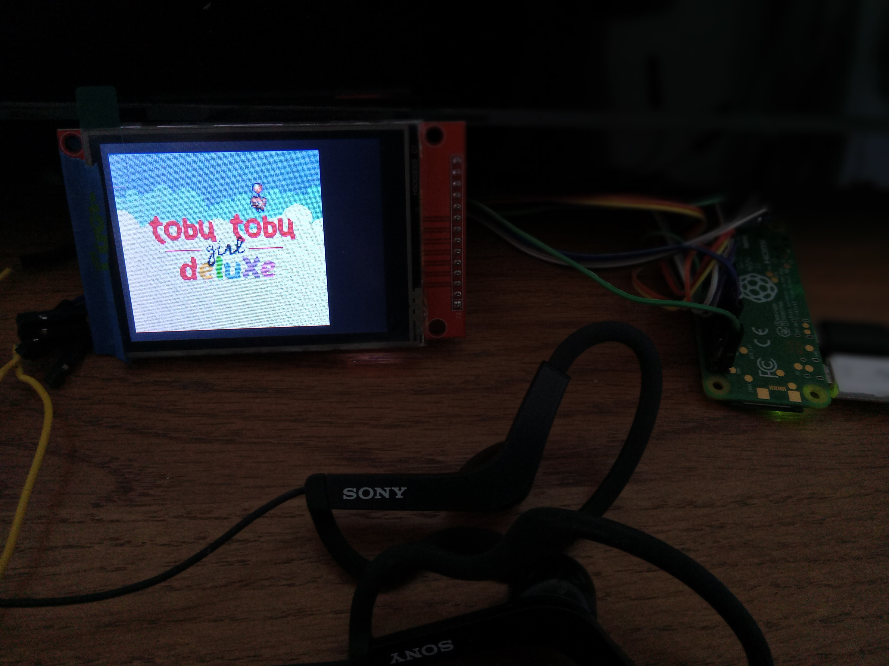
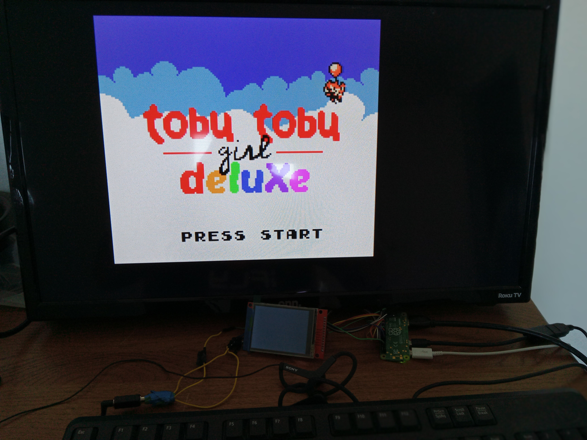

# PeanutGB-RPi02W
<b>Running PeanutGB emulator on a Raspberry Pi Zero 2W</b><br>

<a href="https://github.com/deltabeard/Peanut-GB">Link to Original PeanutGB Repo</a><br>

<b>Purpose:</b><br>
This project is to introduce myself to how the Raspberry Pi Zero 2W works, and further my knowledge on 'modern' microprocessors running Linux.  The immediate goal is to make a handheld device that plays Gameboy and Gameboy Color games that can also connect to the television.  The next goal would be to run Gameboy Advance games as well.  I'm using PeanutGB because I am familiar with it, and I wanted to port something well-designed, well-tested, and that would have no problem running on this device.<br>

<b>Connecting an ILI9341 LCD in SPI mode using pins:</b><br>
CS = GPIO8 / Pin24<br>
MISO = GPIO9 / Pin21<br>
MOSI = GPIO10 / Pin19<br>
SCLK = GPIO11 / Pin23<br>
RESET = GPIO0 / Pin27<br>
DC = GPIO22 / Pin15<br>
LED is connected to 3V3<br>

<b>Connecting a 3.5mm Audio Jack using pins:</b><br>
LEFT = GPIO12 / Pin32<br>
RIGHT = GPIO13 / Pin33<br>

<b>Additional Requirements:</b><br>
You will also need a USB-Micro to USB-A (Female) adapter, and an HDMI-mini to HDMI adapter.<br>

<b>Instructions to Install:</b><br>
1) Re-image an 8GB+ SD Card with Raspberry Pi OS Lite 64-bit.<br>
2) Create user named ``` username ``` with pass named ``` password ```.<br>
3) ``` sudo raspi-config ```, change settings as desired.<br>
4) ``` mkdir ~/PeanutGB ```, put all files found here into that folder.
5) ``` mkdir ~/PeanutGB/ROMS ```, put whatever Gameboy and Gameboy Color ROMs into that folder.
6) You can pull the SD Card from the Pi and connect it to another Linux computer to transfer files, or some other means.<br>
7) ``` sudo nano /boot/firmware/config.txt ```, then add these lines to the bottom under ``` [all] ```:
   ```
   enable_tvout=0
   dtparam=spi=on
   dtoverlay=fbtft,spi0-0,ili9341,bgr,rotate=270,speed=50000000,dc_pin=22,reset_pin=0,framebuffer_width=320,framebuffer_height=240
   dtoverlay=audremap,pins_12_13
   audio_pwm_mode=2
   disable_audio_dither
   ```
8) ``` sudo nano /boot/firmware/cmdline.txt ```, then add to the end of the first line:
   ```
   video=HDMI-A-1:640x480M@60,margin_top=20,margin_bottom=20,margin_left=20,margin_right=20
   ```
8) ``` sudo sh ~/PeanutGB/install.sh ```, then ``` sudo reboot ``` for changes to take effect.
9) To run: ``` sh ~/PeanutGB/run.sh ```, or to auto run on boot: ``` echo 'sh ~/PeanutGB/run.sh' >> ~/.bashrc ```.<br>

<b>Features:</b><br>
- The PeanutGB emulator used is actually a version by 'froggestspirit', found <a href="https://github.com/froggestspirit/Peanut-GB">here</a>, in order to play Gameboy Color games.<br>
- If HDMI is plugged in on boot, games will be played through HDMI.  Else, games will be played through LCD.<br>
- All files here are compiled using ``` gcc ``` and only uses standard Linux libraries.<br>
- In order to draw to the screen, PeanutGB will write directly to ``` /dev/fb0 ```.<br>
- In order to get keyboard events, PeanutGB will read directly from ``` /dev/input/event0 ```.<br>
- In order to send audio data, PeanutGB will stream directly to ``` /dev/dsp ```.<br>
- Warning: ``` /dev/dsp ``` is only available after ``` sudo modprobe snd-pcm-oss ```.<br>

<b>Pictures:</b><br>
<br>
<br>


